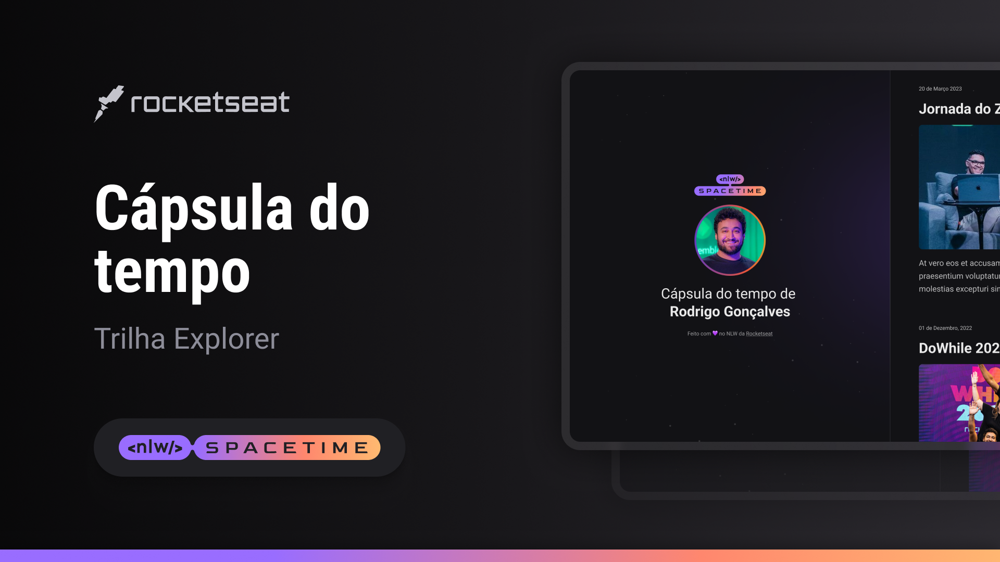

## 🖥️ projeto 
Esse é um projeto web Responsivo de uma cápsula do tempo para exibir memórias em uma linha do tempo.

## 🚀 Tecnologias  
esse projeto foi desenvolvido durante o NLW com as seguintes tecnologias.
-HTML
-CSS
-GIT e Github

## 🏷️ Layout
Você pode visualizar o layout do projeto através 
[desse link](https://www.figma.com/file/AkUyzNuK2MCZvfXWF2PD6M/C%C3%A1psula-do-tempo-%E2%80%A2-Trilha-Explorer?type=design&node-id=306%3A84&t=CV2httHsA09wXVh0-1). 
É necessário ter uma conta no [figma](https://www.figma.com)